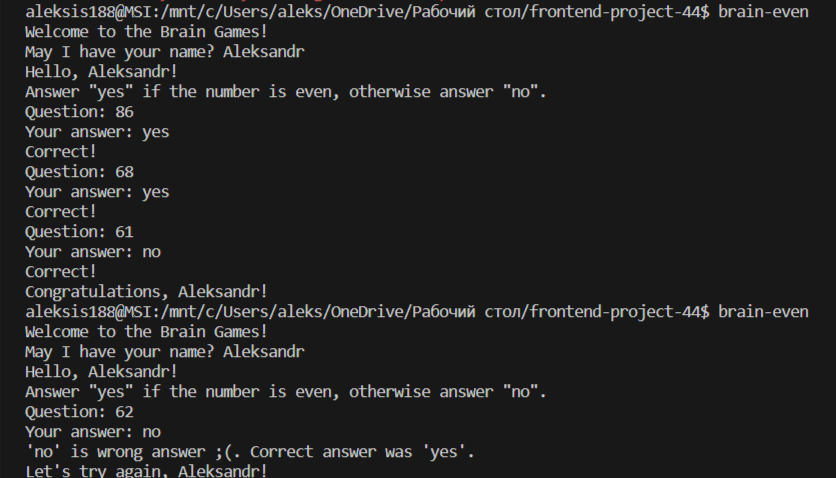
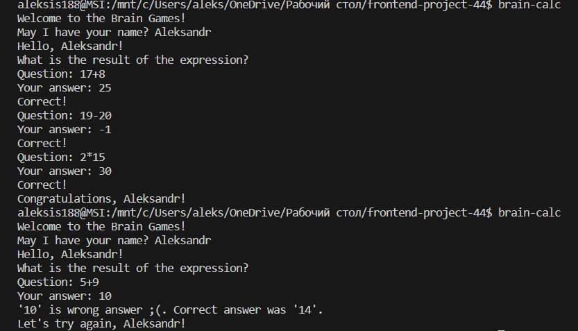
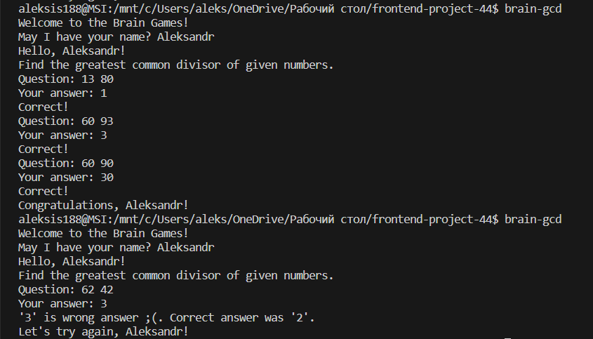
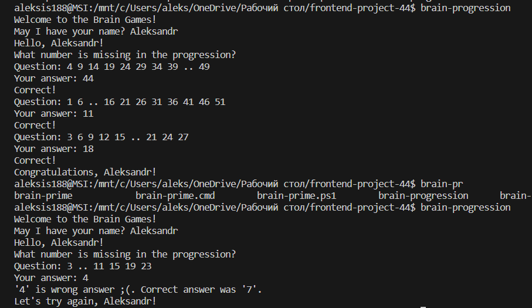

### Hexlet tests and linter status:

Описание проекта:

“Игры разума” — это платформа, состоящая из пяти различных консольных игр. Все игры имеют, соответствующие от их названия, задания, где игроку задаются вопросы, на которые нужно дать правильные ответы. После трех правильных ответов игра считается пройденной, в случае одного неправильного ответа игра завершается с предложением пройти ее заново.

Минимальные требования:

- Node.js версия v20.12.1 (используемая при работе над проектом);

Инструкция по установке и запуску:

- Клонировать репозиторий с проектом, с помощью команды: git clone;
- Перейти в директорию с проектом, с помощью команды: cd <нужная директория>;
- Установить зависимости проекта, с помощью команды: npm ci (или make install);
- Установить пакет локально, с помощью команды: npm link;
- Запускаем нужную игру либо с помощью команды make<название игры>, либо напрямую (у каждой игры своя команда для запуска);

Далее следует список игр с описанием действий для пользователя, прикрепленными скриншотами функционала самой игры.

Игра: "Проверка на чётность"

Суть игры в следующем: пользователю показывается случайное число. И ему нужно ответить yes, если число чётное, или no — если нечётное.
Запуск игры: brain-even 

Игра: "Калькулятор"

Суть игры в следующем: пользователю показывается случайное математическое выражение, которое нужно вычислить и записать правильный ответ.
Запуск игры: brain-calc

Игра "НОД"

Суть игры в следующем: пользователю показывается два случайных числа. Пользователь должен вычислить и ввести наибольший общий делитель этих чисел.
Запуск игры: brain-gcd

Игра "Арифметическая прогрессия"

Суть игры в следующем: игроку показывается ряд чисел, образующий арифметическую прогрессию, заменив любое из чисел двумя точками. Игрок должен определить это число и записать правильный ответ.
Запуск игры: brain-progression

Игра «Простое ли число?»

Суть игры в следующем: пользователю показывается случайное число. И ему нужно ответить yes, если число простое, или no — если не простое.
Запуск игры: brain-prime

